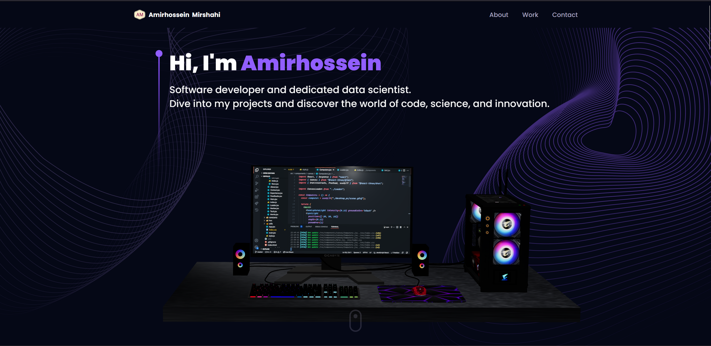

# Interactive 3D Portfolio

Welcome to my interactive 3D portfolio! This project is a showcase of my skills in front-end development, featuring an interactive 3D portfolio created with cutting-edge web technologies such as React, Three.js, and Tailwind CSS.

## Features

- **Immersive 3D Graphics:** The portfolio is built with Three.js, providing an engaging and visually appealing experience.
- **Responsive Design:** Tailwind CSS ensures a responsive layout that looks great on various devices.
- **Automated Deployment:** The project uses GitHub Actions workflows to automate the deployment process to GitHub Pages.

## Getting Started

To get a local copy up and running, follow these steps:

1. Clone the repository: `git clone https://github.com/Delaunay-I/3d_portfolio.git`
2. Install dependencies: `npm install`
3. Start the local server: `npm start`

## Contributing

Contributions are what make the open-source community such an amazing place to learn, inspire, and create. Any contributions you make are greatly appreciated.

1. Fork the Project
2. Create your Feature Branch (`git checkout -b feature/new-feature`)
3. Commit your Changes (`git commit -m 'Add new feature'`)
4. Push to the Branch (`git push origin feature/new-feature`)
5. Open a Pull Request

## License

This project is licensed under the MIT License.

## Contact

Your Name - your@email.com

Project Link: [https://github.com/Delaunay-I/3d_portfolio.git](https://github.com/Delaunay-I/3d_portfolio.git)

Feel free to explore the portfolio and reach out with any suggestions or feedback!